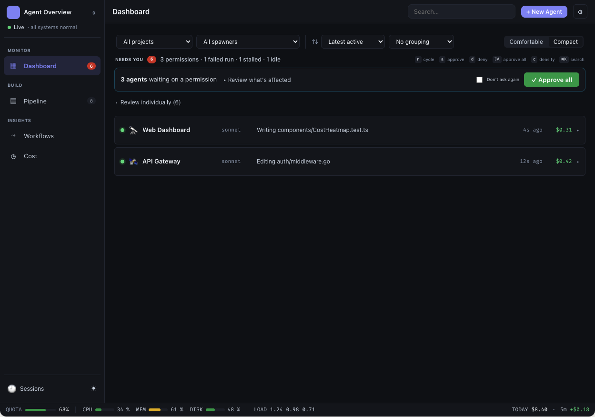

<div align="center">

# Agent Dashboard

**A real-time monitoring and control plane for locally running Claude Code agents.**

See every running agent at a glance — tokens, cost, status, tools, tasks, and subagents — then send instructions, spawn new agents, and drive a multi-stage task pipeline, all from a local browser tab.

[](./LICENSE)
[](https://go.dev/)
[](https://vuejs.org/)
[](https://pnpm.io/)
[](https://github.com/lx-wnk/Agent-Dashboard)

</div>

<p align="center">
  
</p>

## Why Agent Dashboard

Most agent monitors require you to wire hooks or wrappers into every project. This one doesn't — it reads what Claude Code already writes to disk and watches the processes you already run.

- 🔌 **Zero-config monitoring** — discovers agents by scanning processes (`ps`/`lsof`); no per-project hooks or wrappers
- 🔁 **Autonomous task pipeline** — a real state machine that spawns a `claude` CLI process per stage in an isolated git worktree
- 🎛️ **MCP control plane** — an authenticated MCP endpoint with scoped tokens lets agents (and you) drive the dashboard back
- 🔐 **Auth & permissions** — GitHub OAuth + JWT, scoped API keys, and a two-way permission gate for spawned agents
- 🏠 **Local-first** — binds to `127.0.0.1`, hashes tokens, makes no outbound calls unless you opt in. No telemetry, no SaaS

> 📄 [Privacy policy](./PRIVACY.md) · 🔒 [Security model](docs/guides/security.md)

## Features

**Monitor** — real-time agent roster over SSE (list, card, kanban) with tokens, cost, status, and uptime; live active-subtask metrics (token usage, duration, latest output) on every agent and task card; chat-style transcript with collapsible tool groups and subagent badges; `Cmd+K` spotlight search and n-gram pattern discovery.

A **Working** indicator shows when an agent is actively generating, rather than just recently active. It's inferred from whether the agent owes the next reply (conversation turn-state) together with live session output from tmux or the pty broker, so it's distinct from the staleness-based active/waiting/idle states.

When a controllable (channel/MCP-connected) agent exits, its card stays on the dashboard as a **Finished** card in the card grid view instead of vanishing — click it to view the final result, or click ✕ to dismiss it (which removes the agent's channel discovery file). Finished cards are tracked per server run, so after a dashboard restart they're gone; reach those sessions through the **Sessions** overview instead. Agents started in a plain terminal without the dashboard channel still disappear when they exit.

**Build & control** — multi-stage task pipeline (`concept → implementation → review → done`) running in isolated git worktrees behind per-stage permission gates; per-stage engine and model selection (global and per-project); spawn agents and send follow-ups or `/btw` interrupts via MCP channels; refinement chat to shape a concept first; an opt-in plan-review stage that auto-generates and self-reviews the implementation plan and gates on your approval before any files are edited; shared scratchpads and lease-based locks for agent coordination (`agent:coord` MCP scope); drag-and-drop task reordering.

Agents spawned from the dashboard run as interactive **live** sessions rather than one-shot runs, so you can converse with them as they work. Live injection uses tmux when it's available (the agent runs in a detached session) and falls back to a built-in pty broker otherwise. The spawned agent's chat modal opens automatically once it appears on the roster.

**Extend** — authenticated MCP control plane with scoped tokens; in-dashboard `~/.claude` config explorer and git-worktree panel; frontend plugin slots and pluggable LLM adapters (OpenAI-compatible, Ollama, `anthropic`); Web Push, webhook, and email notifications. Plugins are enabled and disabled **live** via `POST /api/plugins/{id}/activate` and `/deactivate` — no server restart needed for most plugins. Exception: plugins with the `auth_provider` capability are boot-wired (they affect server startup) and require a restart to take effect. After toggling one, the settings panel shows a "Restart required to apply" badge and a **Restart server** button; clicking it triggers the restart and a reconnect overlay polls until the server is back, then reloads the page automatically. Route and UI extension plugins are reverse-proxied through a single catch-all at `/api/plugins/{id}/proxy/*`; a stopped or crashed plugin returns HTTP 503 rather than silently disappearing.

**Supported agents / providers** — Claude Code is monitored by default. Codex CLI, Gemini CLI, and Junie CLI can be monitored too, but are opt-in. Enable or disable them from **Settings → Providers** in the dashboard UI — the change is persisted and takes effect within a few seconds without a restart. You can also set `DASHBOARD_PROVIDERS_ENABLED` to a comma-separated list of ids (`codex`, `gemini`, `junie`) as a fallback when no database row exists, or drop your own descriptor YAML files in a directory pointed to by `DASHBOARD_PROVIDER_DIR`. Agents using a local Ollama-served model show a cost of **$0** ("local") instead of "unknown".

See [`docs/`](docs/README.md) for the full feature reference.

## Quickstart

**Prerequisites:** macOS or Linux, [Go 1.26+](https://go.dev/), [Task](https://taskfile.dev) (`brew install go-task/tap/go-task`), [air](https://github.com/air-verse/air) (`go install github.com/air-verse/air@latest`), Node.js 22+ with [pnpm](https://pnpm.io/installation), and Claude Code itself.

> `go install` binaries land in `$(go env GOPATH)/bin` — make sure it's on your `PATH`:
> `echo 'export PATH="$PATH:$(go env GOPATH)/bin"' >> ~/.zshrc && source ~/.zshrc`

```bash
git clone https://github.com/lx-wnk/Agent-Dashboard.git
cd Agent-Dashboard
pnpm install        # frontend dependencies (Go deps are fetched on first build)
task dev            # Go backend (air hot-reload) + Vite — serves on :13120
```

Open **http://localhost:13120** — any running Claude Code agents appear automatically. On loopback with no OAuth configured, the dashboard runs in local-trust mode (no login). See [Security](docs/guides/security.md) before exposing it anywhere.

When iterating on the UI, run `pnpm dev` in a second terminal for HMR on `:5173` (it proxies `/api` → `:13120`).

### Production build

```bash
pnpm build          # build the Vue SPA (embedded into the binary via go:embed)
task build          # compile → bin/agent-dashboard
DASHBOARD_JWT_SECRET=<32+ chars> ./bin/agent-dashboard serve
```

Build the SPA **before** the binary — `go:embed` bakes the compiled frontend into `bin/agent-dashboard`. The result is self-contained: no Node.js needed at runtime. Deploy by copying the binary.

## Restart

`POST /api/admin/restart` triggers a validated, graceful restart. The endpoint refuses with **409** if an active `auth_provider` plugin is currently unhealthy — restarting in that state would cause an auth lockout on the next boot.

**Activating an `auth_provider` plugin requires a restart to apply** (auth is boot-wired, not live-reloadable).

**Default (`DASHBOARD_RESTART_MODE=reexec`):** the process re-execs itself in place — same PID, no supervisor needed. Works with plain `./bin/agent-dashboard serve`.

**Supervised (`DASHBOARD_RESTART_MODE=exit`):** the process exits cleanly so the supervisor relaunches it.

| Supervisor | Required config |
|---|---|
| systemd | `Restart=always` in the service unit |
| launchd | `KeepAlive` in the plist |
| Wrapper loop | `while true; do ./bin/agent-dashboard serve; done` |

## Documentation

| Topic | |
|---|---|
| [Configuration](docs/guides/configuration.md) | Every environment variable |
| [MCP endpoint](docs/guides/mcp.md) | Scopes, tools, local integration |
| [Controlling & spawning agents](docs/guides/agent-control.md) | Channels, spawn dialog, permissions |
| [Security](docs/guides/security.md) | Threat model & hardening |
| [Architecture](docs/architecture/overview.md) | Stack, packages, data flow, pipeline |
| [Shell statusline](docs/guides/statusline.md) | PS1 integration |
| [Agent skills](docs/guides/agent-skills.md) | Installing project skills |

Full index: [`docs/`](docs/README.md).

## Contributing

Contributions are welcome. See [CONTRIBUTING.md](./CONTRIBUTING.md) for setup, the full command reference, the PR process, and code guidelines. In short:

```bash
task test           # all Go tests, race detector
task lint           # golangci-lint
pnpm typecheck      # vue-tsc
```

Found a bug or have an idea? [Open an issue](https://github.com/lx-wnk/Agent-Dashboard/issues/new/choose).

## License

[MIT](./LICENSE) © Alexander Wink
